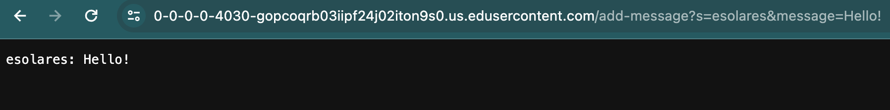
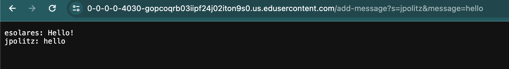
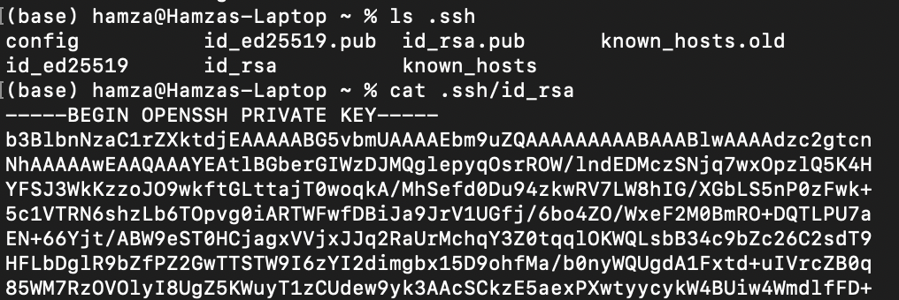
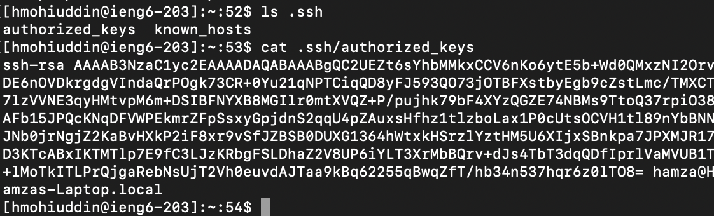
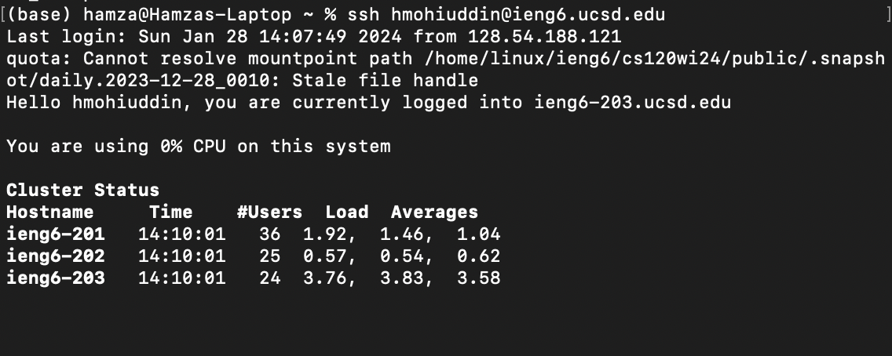

ChatServer Code:     
```
import java.io.IOException;
import java.net.URI;

class Handler implements URLHandler {
    // The one bit of state on the server: a number that will be manipulated by
    // various requests.
    String messages = "";

    public String handleRequest(URI url) {
        if (url.getPath().equals("/")) {
            return messages;
        } 
        else {
            if (url.getPath().contains("/add-message")) {
                String[] parameters = url.getQuery().split("=");
                if (parameters[0].equals("s")) {
                    String message = parameters[1].substring(0, parameters[1].indexOf("&"));
                    String user = parameters[2];
                    messages += message + ": " + user + "\n";
                    return messages;
                }
            }
            return "404 Not Found";
        }
    }
}

class ChatServer {
    public static void main(String[] args) throws IOException {
        if(args.length == 0){
            System.out.println("Missing port number! Try any number between 1024 to 49151");
            return;
        }

        int port = Integer.parseInt(args[0]);

        Server.start(port, new Handler());
    }
}
```
Message 1:     
   
For message 1, the main function is called to run the server in the first place with the int value for port number 4030 (from command line argument) as the argument as well as a new Handler object. When I press enter, the handleRequest method is called and it takes the ```URI url: https://0-0-0-0-4030-n124sl7ul2s9gkraltq5h77pds.us.edusercontent.com/add-message?s=esolares&message=Hello!```  as an argument       

The ```String messages``` field stores every message in the chat, separated by a \n for each new line. The method parses the query part of the url and extracts the ```String message: "Hello!"``` and ```String user: "esolares"``` variables from the ```String[] parameters: {"s", "esolares&message", "Hello!"}``` array that stores the parameters. The method then concatenates the new message log to the ```messages``` string and returns ```messages``` to be displayed. With every request, ```messages``` is changed and concatenated. The ```user```, ```parameters```, and ```message``` are instance variables, so they are created anew every time the method is called.          
       
For message 2, the same variables and fields follow the same behavior. The handleRequest method takes the ```URI url: https://0-0-0-0-4030-n124sl7ul2s9gkraltq5h77pds.us.edusercontent.com/add-message?s=jpolitz&message=hello``` as its argument. ```int port: 4030``` is also passed into the Server.start method.        

The ```String messages``` field stores the chat log from the last call, ```esolares: Hello!```. Then, the method extracts ```String message: "hello"``` and ```String user: "jpolitz"``` variables from the ```String[] parameters: {"s", "jpolitz&message", "hello"}``` array. handleRequest then concatenates the new message log to the ```messages``` String, and returns ```messages``` to be displayed. As previously mentioned, ```messages``` is changed with every call as it is a class field, and the rest of the variables are instance variables and are not changed, but created with every call.      

Absolute path to private key:    
     
Absolute path to public key:      
      
Terminal interaction:    
      

In this lab, I learned how to run a server in java using the Server class. I did not know how to do this before, so this might become useful in the future.      


