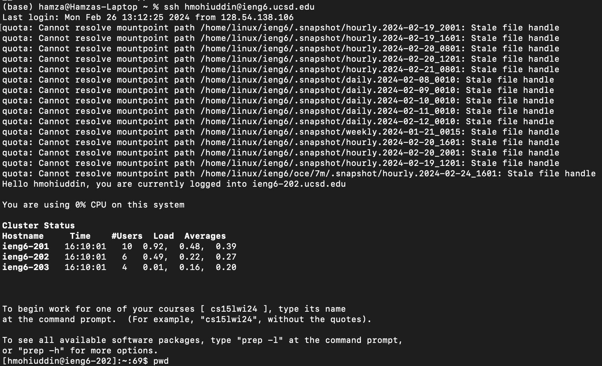
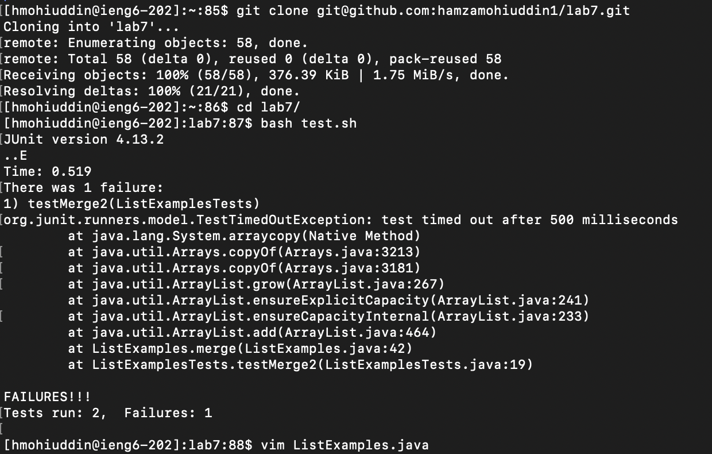
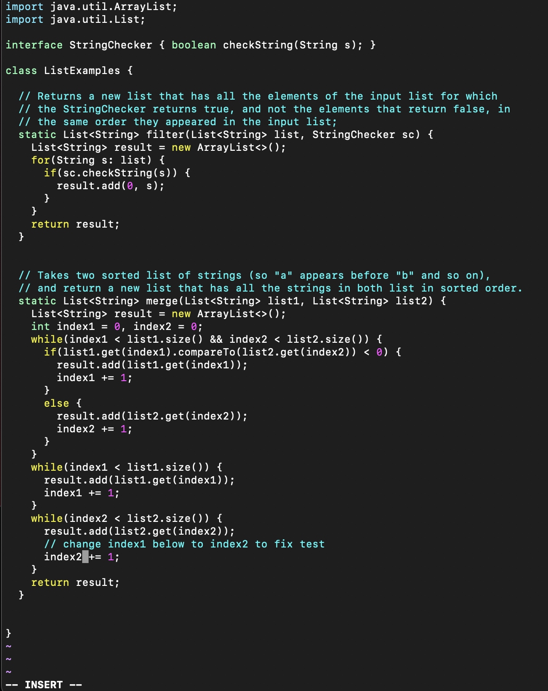
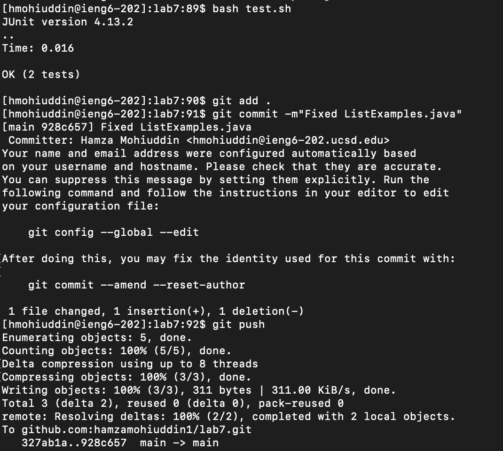

Step 4: Log into ieng6    
    
First, I typed into my terminal ```ssh hmohiuddin@ieng6.ucsd.edu<enter>```. Since I had my ssh keys registered, I did not have to enter any password and I successfully ssh'ed into the server.    
Step 5: Clone your fork of the repository from your Github account (using the SSH URL)     
Step 6: Run the tests, demonstrating that they fail      
     
First, I typed  ```git clone <^v> <enter>``` since I had the ssh url for my forked repo copied onto my keyboard. This cloned the repository. Then I typed ```cd l<tab><enter>```. Since ```/lab7``` was the only directory/file in the working directory that started with 'l', I only had to type ```l``` and press ```<tab>``` and it auto-filled to ```cd lab7```. Then I typed ```bash t<tab><enter>```. ```test.sh``` was the only file in ```lab7``` that started with ```t```, so pressing ```<tab>``` auto-filled to ```bash test.sh```. This ran the tests and displayed the results. Then I typed ```vim L<tab>.j<tab><enter>```. Since ```ListExamples.java``` is the only file that starts with ```L```, it was autofilled to ```vim ListExamples```. Then I typed ```.j``` to specify that I am looking for ```ListExamples.java``` and not ```ListExamplesTests.java```. This autofilled to ```vim ListExamples.java```. This put me into the vim editor.      
Step 7: Edit the code to fix the failing test    

First, I typed ```:/index1<enter>``` since I started in command mode. This searched for all instances of the ```index1```. Then I types ```N``` to search from the bottom of the file, since I was targeting the last instance. From there, I wanted to move six characters to the right to change the ```1``` to a ```2```, so I typed ```<right><right><right><right><right><right>i<delete><2><escape>``` to move to the character, go into insert mode, make the changes, and go back into command mode. Then I typed ```:wq<enter>``` to save my changes and exit.     
Step 8: Run the tests, demonstrating that they now succeed     
Step 9: Commit and push the resulting change to your Github account (you can pick any commit message!     
      
First, I typed ```<up><up><enter>``` because the command ```bash test.sh``` was two commands ago, and it filled appropriately and ran the tests. Then I typed ```git add .<enter>``` to stage my changes to all of the files (even though I only changed one). Then I types ```git commit -m"Fixed ListExamples.java"<enter>``` To commit, and then ```git push<enter>``` to push my changes to github.    
