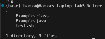
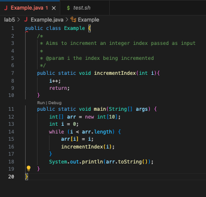
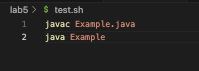
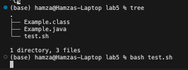

Title: Java file running forever    
Description: For context, here is my current working directory tree along with the contents of each file.    
    
Here, I am in the ```lab5/``` which contains ```Examples.java``` and ```test.sh```    
    
In the ```main``` method, I create an integer array ```arr``` and a ```while``` loop that has an index ```i``` starting at zero that is meant to fill 
the array with elements equal to their indexes. My index variable ```i``` is incremented by a static method ```incrementIndex``` that takes the index
as input and increments it. After that, I print the string representation of the pointer to ```arr``` by using its built in ```toString``` method.       
     
Here, my ```test.sh``` file compiles ```Examples.java``` and runs ```Examples.class```. This triggers the main method of ```Examples``` with additional
arguments.    
The issue here is that when I run ```bash test.sh```, no terminal output is displayed, when I expect some kind of memory location which is supposed to be the string representation of the pointer to ```arr```. Instead, ```test.sh``` seems to run forever.      
       
I think there is something wrong with the way I compiled ```Examples.java```
but I am not sure. Could someone point out where things go wrong? Thank you!        
        
Response:    
Hey Hamza! Thank you for reaching out. It seems you are misunderstanding the behavior of methods and primitive data types. In
```Examples.java```, You are correct in understanding that you need to increment ```i``` at the end of each iteration of the 
```while``` loop. However, the issue is where you call the ```incrementIndex``` method. When you pass a variable of a
primitive data type such as ```int```, the method creates a copy of the variable called and instance variable, and performs
operations on this copy. In your case, the method is not incrementing the same ```i``` that you pass into it. It is creating
a copy of ```i``` and incrementing that, while your original ```i``` is left unchanged. As a result, your index does not increment
and the ```while``` loop runs forever because ```i<arr.length``` is always ```0```. Instead, I would suggest a simpler way of
incrementing ```i``` that perhaps takes place inside the loop instead of a different method. I hope this helps, let me know if you have
any questions!     


